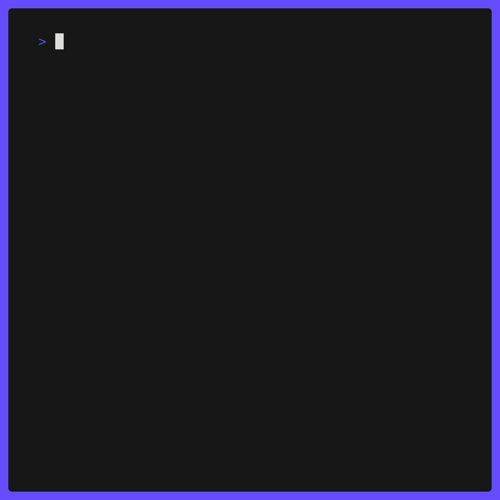

GeoSilhouette

> CLI based country guesser game

## Demo



## Installation

### Clone the Repo

```bash
git clone https://github.com/harsh-m-patil/GeoSilhouette
```

### Build with go

```bash
go build .
```

### Run

```bash
./GeoSilhouette
```

Ascii Country Art from

[acidus99](https://github.com/acidus99/ascii-countries.git)
